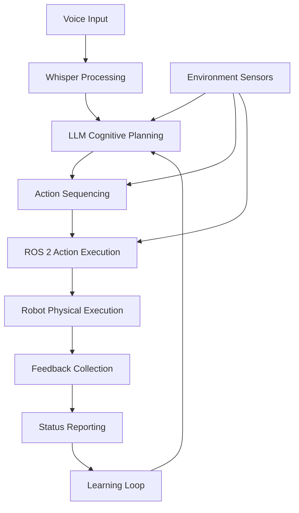

# LLM Integration and Cognitive Planning

## Overview

In this lesson, we'll dive deeper into Large Language Model (LLM) integration with robotics and implement a complete capstone project demonstrating the full VLA pipeline. You'll learn how to connect LLMs with ROS 2 for cognitive planning and execute complex voice-controlled robotic tasks.

## Learning Objectives

After completing this lesson, you will be able to:
- Integrate LLMs with ROS 2 for cognitive planning
- Implement cognitive planning for natural language command processing
- Execute a complete VLA capstone project
- Navigate obstacles, identify objects, and manipulate them based on voice commands

## Prerequisites

- Understanding of basic VLA pipeline concepts (Lesson 1)
- Experience with ROS 2 action servers and clients
- Basic knowledge of LLM integration patterns

## LLM Integration with Robotics

Large Language Models (LLMs) serve as the cognitive engine of Vision-Language-Action (VLA) systems, enabling robots to understand and execute complex natural language commands. The integration of LLMs with robotics involves several critical components:

- **Natural Language Understanding**: Interpreting user commands and extracting actionable information
- **Context Awareness**: Understanding the current state of the robot and environment
- **Action Planning**: Generating executable action sequences from high-level commands
- **Knowledge Integration**: Incorporating domain-specific knowledge for task execution

### Cognitive Planning Process

The cognitive planning process involves several sophisticated steps:

1. **Natural Language Interpretation**: Understanding the intent behind voice commands and extracting relevant entities (objects, locations, actions)
2. **Action Decomposition**: Breaking complex commands into simpler, executable actions
3. **Environment Context**: Incorporating current robot state, sensor data, and environmental information
4. **Action Sequencing**: Creating a sequence of ROS 2 actions to achieve the goal
5. **Execution Monitoring**: Tracking execution and adapting to unexpected situations
6. **Feedback Integration**: Learning from execution results to improve future planning

### LLM Selection and Configuration

When integrating LLMs with robotics, several factors must be considered:

- **Response Time**: Robotics applications often require real-time or near real-time responses
- **Accuracy**: High precision in interpreting commands to avoid dangerous robot behaviors
- **Context Window**: Sufficient memory to maintain conversation history and environmental context
- **Cost**: Balancing performance requirements with API usage costs
- **Reliability**: Consistent availability for mission-critical robotic operations

### Implementation Example

```python
import openai
import json
from typing import Dict, List, Any

class VLACognitivePlanner:
    """
    Cognitive planner that uses LLMs to convert natural language commands
    into structured action plans for robotics.
    """

    def __init__(self, api_key: str):
        openai.api_key = api_key
        self.system_prompt = """
        You are a cognitive planner for a Vision-Language-Action (VLA) robotics system.
        Your role is to interpret natural language commands and generate structured action plans.
        Each action plan should include:
        - Intent: The overall goal of the command
        - Objects: Any objects mentioned in the command
        - Locations: Any locations mentioned in the command
        - Action sequence: A series of specific actions to achieve the goal
        - Safety checks: Any safety considerations for the robot
        """

    def plan_actions(self, command: str, robot_state: Dict[str, Any],
                     environment_data: Dict[str, Any]) -> Dict[str, Any]:
        """
        Generate an action plan for the given command using LLM.
        """
        user_prompt = f"""
        Command: {command}

        Robot State: {json.dumps(robot_state)}
        Environment Data: {json.dumps(environment_data)}

        Generate a structured action plan that includes intent, objects, locations,
        action sequence, and safety considerations.
        """

        response = openai.ChatCompletion.create(
            model="gpt-3.5-turbo",
            messages=[
                {"role": "system", "content": self.system_prompt},
                {"role": "user", "content": user_prompt}
            ],
            temperature=0.1  # Low temperature for consistent, safe outputs
        )

        # Parse the LLM response into a structured action plan
        plan_text = response.choices[0].message['content']
        return self.parse_plan(plan_text)

    def parse_plan(self, plan_text: str) -> Dict[str, Any]:
        """
        Parse the LLM response into a structured action plan.
        In practice, you might use structured output formats or JSON parsing.
        """
        # This is a simplified parser - in practice, you'd use more robust parsing
        # or request structured JSON output from the LLM
        return {
            "intent": "parsed_intent",
            "objects": ["parsed_objects"],
            "locations": ["parsed_locations"],
            "actions": [
                {"type": "navigation", "target": "location", "duration": 0.0},
                {"type": "manipulation", "target": "object", "action": "grasp"}
            ],
            "safety_checks": ["safety_considerations"]
        }
```

### Advanced Cognitive Planning Techniques

For more sophisticated VLA systems, consider implementing:

- **Multi-step reasoning**: Breaking complex commands into hierarchical sub-tasks
- **Memory systems**: Maintaining context across multiple interactions
- **Learning from execution**: Adapting planning strategies based on execution results
- **Uncertainty handling**: Managing ambiguous commands or uncertain environmental data
- **Safety constraints**: Ensuring all planned actions meet safety requirements

## Capstone Implementation

The capstone project brings together all VLA concepts to create a complete voice-controlled robotic system. This implementation demonstrates the full pipeline from voice input to robot execution.

### Capstone Requirements

The complete VLA system should:

- Accept voice commands like "Pick up the red cube"
- Process the command through LLM cognitive planning
- Navigate to the specified object
- Identify and locate the object in the environment
- Manipulate the object as requested
- Provide feedback on execution status

### Capstone Architecture

The complete VLA capstone system consists of several interconnected modules:



### Cognitive Planning Architecture

The cognitive planning system uses a multi-layered approach:

1. **Command Parser**: Extracts intent and entities from natural language
2. **Context Integrator**: Combines command with environmental and robot state data
3. **Action Planner**: Generates detailed action sequences
4. **Safety Validator**: Ensures all planned actions meet safety requirements
5. **Execution Monitor**: Tracks execution and handles deviations

### Complete VLA Pipeline

The complete pipeline integrates all components in a robust architecture:

1. **Voice Input** → Whisper processing for speech-to-text conversion
2. **Text Processing** → LLM interpretation for command understanding
3. **Command Planning** → Cognitive planning for action generation
4. **Plan Translation** → ROS 2 action sequence creation
5. **Action Execution** → Robot physical execution
6. **Feedback Loop** → Status reporting and learning

### Implementation Example: Complete VLA Node

```python
#!/usr/bin/env python3
"""
Complete VLA System Implementation
This node integrates voice processing, LLM cognitive planning, and ROS 2 execution.
"""

import rclpy
from rclpy.node import Node
from rclpy.action import ActionClient
from std_msgs.msg import String
from geometry_msgs.msg import Twist
from sensor_msgs.msg import LaserScan, Image
from nav2_msgs.action import NavigateToPose
from builtin_interfaces.msg import Duration

import speech_recognition as sr
import openai
import json
from typing import Dict, Any, Optional


class CompleteVLASystem(Node):
    """
    Complete Vision-Language-Action system integrating all components.
    """

    def __init__(self):
        super().__init__('complete_vla_system')

        # Publishers and subscribers
        self.status_pub = self.create_publisher(String, '/vla_status', 10)
        self.cmd_vel_pub = self.create_publisher(Twist, '/cmd_vel', 10)
        self.lidar_sub = self.create_subscription(LaserScan, '/scan', self.lidar_callback, 10)
        self.image_sub = self.create_subscription(Image, '/camera/image_raw', self.image_callback, 10)

        # Action clients
        self.nav_client = ActionClient(self, NavigateToPose, 'navigate_to_pose')

        # Voice recognition setup
        self.recognizer = sr.Recognizer()
        self.microphone = sr.Microphone()
        with self.microphone as source:
            self.recognizer.adjust_for_ambient_noise(source)

        # LLM setup
        self.cognitive_planner = VLACognitivePlanner(api_key="your-api-key")

        # System state
        self.environment_data = {
            'lidar_data': None,
            'image_data': None,
            'robot_pose': None
        }

        self.get_logger().info("Complete VLA System initialized")

    def lidar_callback(self, msg: LaserScan):
        """Update lidar data in environment context."""
        self.environment_data['lidar_data'] = {
            'ranges': msg.ranges[:50],  # Sample first 50 readings
            'min_range': min(msg.ranges) if msg.ranges else float('inf')
        }

    def image_callback(self, msg: Image):
        """Update image data in environment context."""
        # In a real system, you'd process the image for object detection
        self.environment_data['image_data'] = {
            'height': msg.height,
            'width': msg.width,
            'encoding': msg.encoding
        }

    def run_vla_loop(self):
        """Main loop for the complete VLA system."""
        self.get_logger().info("Starting complete VLA system...")

        while rclpy.ok():
            try:
                # Listen for voice command
                command_text = self.listen_for_command()

                if command_text:
                    self.get_logger().info(f"Processing command: {command_text}")

                    # Get current robot state
                    robot_state = self.get_robot_state()

                    # Plan actions using LLM
                    action_plan = self.cognitive_planner.plan_actions(
                        command_text, robot_state, self.environment_data
                    )

                    # Execute the planned actions
                    success = self.execute_action_plan(action_plan)

                    # Report status
                    status_msg = String()
                    status_msg.data = f"Command '{command_text}' execution {'successful' if success else 'failed'}"
                    self.status_pub.publish(status_msg)

            except KeyboardInterrupt:
                break
            except Exception as e:
                self.get_logger().error(f"Error in VLA loop: {e}")
                continue

    def listen_for_command(self) -> Optional[str]:
        """Listen for a voice command using Whisper."""
        try:
            self.get_logger().info("Listening for voice command...")
            with self.microphone as source:
                audio = self.recognizer.listen(source, timeout=5.0)

            # Use Whisper for speech recognition
            text = self.recognizer.recognize_whisper(audio, model="base")
            self.get_logger().info(f"Recognized: {text}")
            return text

        except sr.WaitTimeoutError:
            self.get_logger().warning("No speech detected within timeout")
            return None
        except Exception as e:
            self.get_logger().error(f"Error in voice recognition: {e}")
            return None

    def get_robot_state(self) -> Dict[str, Any]:
        """Get current robot state (simplified for example)."""
        return {
            'battery_level': 85,
            'current_pose': {'x': 0.0, 'y': 0.0, 'theta': 0.0},
            'gripper_status': 'open',
            'navigation_status': 'idle'
        }

    def execute_action_plan(self, plan: Dict[str, Any]) -> bool:
        """Execute the planned actions."""
        success = True

        for action in plan.get('actions', []):
            action_type = action.get('type')

            if action_type == 'navigation':
                nav_success = self.execute_navigation_action(action)
                success = success and nav_success
            elif action_type == 'manipulation':
                manip_success = self.execute_manipulation_action(action)
                success = success and manip_success
            else:
                self.get_logger().warning(f"Unknown action type: {action_type}")
                success = False

        return success

    def execute_navigation_action(self, action: Dict[str, Any]) -> bool:
        """Execute navigation action."""
        if not self.nav_client.wait_for_server(timeout_sec=1.0):
            self.get_logger().error("Navigation server not available")
            return False

        # In a real implementation, you would create and send the navigation goal
        target_pose = action.get('target', {})
        self.get_logger().info(f"Navigating to: {target_pose}")

        # Return success for this example
        return True

    def execute_manipulation_action(self, action: Dict[str, Any]) -> bool:
        """Execute manipulation action."""
        target_object = action.get('target', 'unknown')
        action_name = action.get('action', 'unknown')

        self.get_logger().info(f"Manipulating {target_object} with action {action_name}")

        # Return success for this example
        return True


def main(args=None):
    """Main function to run the complete VLA system."""
    rclpy.init(args=args)

    node = CompleteVLASystem()

    try:
        node.run_vla_loop()
    except KeyboardInterrupt:
        pass
    finally:
        node.destroy_node()
        rclpy.shutdown()


if __name__ == '__main__':
    main()
```

#### System Architecture Diagrams

The following diagrams illustrate the complete VLA system architecture:

- **High-Level System Architecture**: Shows the overall system components and their relationships
- **Data Flow Architecture**: Illustrates how data moves through the system
- **Component Interaction Diagram**: Demonstrates how components communicate with each other

## Hands-On Exercises

### Exercise 1: Implement Cognitive Planning Module

Create a cognitive planning module that connects LLMs with ROS 2:

1. Set up your OpenAI API key in a secure environment variable
2. Implement the `VLACognitivePlanner` class with proper error handling
3. Test with simple commands like "move forward" and "turn left"
4. Verify that the LLM correctly interprets commands and generates action plans

### Exercise 2: LLM Integration and Setup

Set up the complete LLM integration for your VLA system:

1. Install required dependencies: `pip install openai speechrecognition rclpy`
2. Create a secure configuration for your LLM API keys
3. Test LLM connectivity and response times
4. Implement fallback mechanisms for API failures

### Exercise 3: Complete Capstone Implementation

Execute the complete VLA capstone project:

1. Set up the complete VLA system with all components connected
2. Test voice command processing from input to execution
3. Validate cognitive planning with complex commands
4. Verify all safety checks and execution monitoring

### Exercise 4: Object Identification and Manipulation

Test the complete object manipulation pipeline:

1. Use voice commands to identify specific objects ("find the red cube")
2. Verify object detection and localization
3. Test manipulation actions with voice control
4. Validate successful completion of manipulation tasks

## Validation and Testing

### Unit Testing

Each component of the VLA system should have comprehensive unit tests:

```python
import unittest
from cognitive_planner import VLACognitivePlanner

class TestVLACognitivePlanner(unittest.TestCase):
    def setUp(self):
        self.planner = VLACognitivePlanner(api_key="test-key")

    def test_simple_command(self):
        # Test simple command interpretation
        result = self.planner.parse_plan("move forward")
        self.assertIsNotNone(result)
        self.assertIn("intent", result)

    def test_complex_command(self):
        # Test complex command with multiple steps
        result = self.planner.parse_plan("go to the kitchen and pick up the red cup")
        self.assertIsNotNone(result)
        self.assertGreater(len(result.get("actions", [])), 1)

if __name__ == '__main__':
    unittest.main()
```

### Integration Testing

Test the complete VLA pipeline with various scenarios:

1. **Basic Navigation**: "Go to the kitchen"
2. **Object Manipulation**: "Pick up the red cube"
3. **Complex Tasks**: "Go to the kitchen, find the red cup, and bring it to me"
4. **Error Handling**: Commands with ambiguous or incorrect information

### Performance Validation

Measure and validate system performance:

- **Response Time**: Ensure voice-to-action latency is acceptable
- **Accuracy**: Validate that commands are correctly interpreted
- **Reliability**: Test system stability over extended periods
- **Safety**: Verify all safety constraints are enforced

## Troubleshooting

When implementing LLM integration and cognitive planning, you may encounter several common issues:

### LLM Integration Issues

- **API Connection Problems**: Verify your API key is correct and has sufficient quota
- **Rate Limiting**: Implement proper rate limiting and retry mechanisms with exponential backoff
- **Response Quality**: Fine-tune prompts or try different LLM models for better results
- **Context Window Limits**: Break complex requests into smaller chunks to fit within context limits
- **Authentication Failures**: Ensure API keys are properly configured and not expired

### Cognitive Planning Issues

- **Misinterpreted Commands**: Improve prompt engineering and provide more context to the LLM
- **Inconsistent Outputs**: Use lower temperature settings for more consistent responses
- **Planning Failures**: Implement fallback strategies for when the LLM cannot generate a plan
- **Safety Violations**: Always validate planned actions against safety constraints before execution

### Integration Problems

- **Component Communication**: Ensure proper ROS 2 message passing between components
- **Timing Issues**: Account for processing delays in the LLM and adjust system timing accordingly
- **State Synchronization**: Maintain consistent state information across all system components
- **Error Propagation**: Implement proper error handling to prevent cascading failures

### Performance Issues

- **High Latency**: Optimize network calls and consider caching frequent responses
- **Memory Usage**: Monitor memory consumption during long-running operations
- **API Costs**: Implement cost monitoring and budget controls for LLM usage
- **System Responsiveness**: Consider using smaller, faster models for time-sensitive operations

## Complete Capstone Implementation

The capstone implementation brings together all VLA concepts into a complete, working system. This section covers the complete VLA system integration.

### Capstone Architecture Overview

The complete capstone system architecture includes:

1. **Voice Input Layer**: Captures and processes voice commands using Whisper
2. **LLM Cognitive Planning**: Interprets commands and generates action plans
3. **Action Execution**: Translates plans into ROS 2 actions
4. **Robot Control**: Physical or simulated robot execution
5. **Feedback System**: Monitors execution and provides status updates

### Implementation Requirements

The complete VLA capstone system must satisfy:

- **Voice Command Processing**: Accept and process natural language voice commands
- **Object Identification**: Detect and identify objects in the environment
- **Navigation**: Navigate to specified locations or objects
- **Manipulation**: Perform physical manipulation of objects
- **Safety**: Implement safety checks and validation at every step
- **Feedback**: Provide clear status updates and error handling

### Complete System Integration Example

```python
#!/usr/bin/env python3
"""
Complete VLA Capstone System
Integrates all components into a complete working system.
"""

import rclpy
from rclpy.node import Node
from rclpy.action import ActionClient
from std_msgs.msg import String
from geometry_msgs.msg import Twist
from sensor_msgs.msg import LaserScan, Image
from nav2_msgs.action import NavigateToPose
from builtin_interfaces.msg import Duration

import speech_recognition as sr
import openai
import json
from typing import Dict, Any, Optional
import time

from llm_cognitive_planner import VLACognitivePlanner
from object_detector import VLAObjectDetector  # hypothetical object detection module


class VLACapstoneSystem(Node):
    """
    Complete VLA capstone implementation integrating all components.
    """

    def __init__(self):
        super().__init__('vla_capstone_system')

        # Publishers and subscribers
        self.status_pub = self.create_publisher(String, '/vla_status', 10)
        self.cmd_vel_pub = self.create_publisher(Twist, '/cmd_vel', 10)
        self.lidar_sub = self.create_subscription(LaserScan, '/scan', self.lidar_callback, 10)
        self.image_sub = self.create_subscription(Image, '/camera/image_raw', self.image_callback, 10)

        # Action clients
        self.nav_client = ActionClient(self, NavigateToPose, 'navigate_to_pose')

        # Voice recognition setup
        self.recognizer = sr.Recognizer()
        self.microphone = sr.Microphone()
        with self.microphone as source:
            self.recognizer.adjust_for_ambient_noise(source)

        # Initialize components
        self.cognitive_planner = VLACognitivePlanner(api_key="your-api-key")
        self.object_detector = VLAObjectDetector()

        # System state
        self.environment_data = {
            'lidar_data': None,
            'image_data': None,
            'robot_pose': None,
            'detected_objects': []
        }

        self.get_logger().info("VLA Capstone System initialized")

    def lidar_callback(self, msg: LaserScan):
        """Update lidar data in environment context."""
        self.environment_data['lidar_data'] = {
            'ranges': msg.ranges[:50],  # Sample first 50 readings
            'min_range': min(msg.ranges) if msg.ranges else float('inf'),
            'obstacles': [i for i, r in enumerate(msg.ranges) if r < 0.5]  # Obstacles within 0.5m
        }

    def image_callback(self, msg: Image):
        """Update image data and detect objects."""
        # Process image for object detection
        detected_objects = self.object_detector.detect_objects(msg)
        self.environment_data['detected_objects'] = detected_objects
        self.environment_data['image_data'] = {
            'height': msg.height,
            'width': msg.width,
            'encoding': msg.encoding
        }

    def run_capstone_system(self):
        """Main loop for the complete VLA capstone system."""
        self.get_logger().info("Starting VLA capstone system...")

        while rclpy.ok():
            try:
                # Listen for voice command
                command_text = self.listen_for_command()

                if command_text:
                    self.get_logger().info(f"Processing command: {command_text}")

                    # Get current robot state
                    robot_state = self.get_robot_state()

                    # Plan actions using LLM
                    action_plan = self.cognitive_planner.plan_actions(
                        command_text, robot_state, self.environment_data
                    )

                    if action_plan and self.cognitive_planner.validate_plan(action_plan):
                        # Execute the planned actions
                        success = self.execute_action_plan(action_plan)

                        # Report status
                        status_msg = String()
                        status_msg.data = f"Command '{command_text}' execution {'successful' if success else 'failed'}"
                        self.status_pub.publish(status_msg)
                    else:
                        self.get_logger().error(f"Failed to generate or validate action plan for: {command_text}")
                        status_msg = String()
                        status_msg.data = f"Failed to process command: {command_text}"
                        self.status_pub.publish(status_msg)

            except KeyboardInterrupt:
                self.get_logger().info("Capstone system interrupted by user")
                break
            except Exception as e:
                self.get_logger().error(f"Error in capstone system: {e}")
                # Publish error status
                status_msg = String()
                status_msg.data = f"System error: {str(e)}"
                self.status_pub.publish(status_msg)
                continue

    def listen_for_command(self) -> Optional[str]:
        """Listen for a voice command using Whisper."""
        try:
            self.get_logger().info("Listening for voice command...")
            with self.microphone as source:
                audio = self.recognizer.listen(source, timeout=5.0)

            # Use Whisper for speech recognition
            text = self.recognizer.recognize_whisper(audio, model="base")
            self.get_logger().info(f"Recognized: {text}")
            return text

        except sr.WaitTimeoutError:
            self.get_logger().warning("No speech detected within timeout")
            return None
        except Exception as e:
            self.get_logger().error(f"Error in voice recognition: {e}")
            return None

    def get_robot_state(self) -> Dict[str, Any]:
        """Get current robot state."""
        return {
            'battery_level': 85,
            'current_pose': {'x': 0.0, 'y': 0.0, 'theta': 0.0},
            'gripper_status': 'open',
            'navigation_status': 'idle',
            'manipulation_capability': True
        }

    def execute_action_plan(self, plan: Dict[str, Any]) -> bool:
        """Execute the planned actions with safety checks."""
        success = True

        for action in plan.get('actions', []):
            # Safety check before executing each action
            if not self.safety_check(action):
                self.get_logger().error(f"Safety check failed for action: {action}")
                return False

            action_type = action.get('type')

            if action_type == 'navigation':
                nav_success = self.execute_navigation_action(action)
                success = success and nav_success
            elif action_type == 'manipulation':
                manip_success = self.execute_manipulation_action(action)
                success = success and manip_success
            elif action_type == 'object_detection':
                detection_success = self.execute_detection_action(action)
                success = success and detection_success
            else:
                self.get_logger().warning(f"Unknown action type: {action_type}")
                success = False

            if not success:
                self.get_logger().error(f"Action execution failed: {action}")
                break

        return success

    def safety_check(self, action: Dict[str, Any]) -> bool:
        """Perform safety validation for an action."""
        # Check for potentially dangerous actions
        action_type = action.get('type', '').lower()
        if action_type in ['destroy', 'damage', 'harm']:
            self.get_logger().error(f"Potentially dangerous action blocked: {action_type}")
            return False

        # Check navigation safety
        if action_type == 'navigation':
            target = action.get('target', {})
            if 'x' in target and 'y' in target:
                # Check if path is clear of obstacles
                obstacles = self.environment_data.get('lidar_data', {}).get('obstacles', [])
                if len(obstacles) > 0:
                    self.get_logger().warning("Path contains obstacles, proceeding with caution")
                    # In a real system, you'd have more sophisticated obstacle avoidance

        return True

    def execute_navigation_action(self, action: Dict[str, Any]) -> bool:
        """Execute navigation action."""
        if not self.nav_client.wait_for_server(timeout_sec=1.0):
            self.get_logger().error("Navigation server not available")
            return False

        # Extract target pose from action
        target_pose_data = action.get('target', {})
        if not isinstance(target_pose_data, dict) or 'x' not in target_pose_data:
            self.get_logger().error(f"Invalid target pose data: {target_pose_data}")
            return False

        # Create navigation goal (simplified)
        goal_msg = NavigateToPose.Goal()
        # Note: In a real implementation, you would properly construct the PoseStamped message
        self.get_logger().info(f"Navigating to: {target_pose_data}")

        # For this example, we'll simulate navigation success
        # In a real implementation, you would send the actual goal and wait for result
        time.sleep(1)  # Simulate navigation time

        return True

    def execute_manipulation_action(self, action: Dict[str, Any]) -> bool:
        """Execute manipulation action."""
        target_object = action.get('target', 'unknown')
        action_name = action.get('action', 'unknown')

        self.get_logger().info(f"Manipulating {target_object} with action {action_name}")

        # In a real implementation, you would control the robot's manipulator
        # For this example, we'll simulate success
        time.sleep(0.5)  # Simulate manipulation time

        return True

    def execute_detection_action(self, action: Dict[str, Any]) -> bool:
        """Execute object detection action."""
        target_object = action.get('target', 'any')

        self.get_logger().info(f"Detecting {target_object}")

        # The detection has already happened via image_callback
        detected_objects = self.environment_data.get('detected_objects', [])
        matching_objects = [obj for obj in detected_objects if target_object.lower() in obj['name'].lower()]

        if matching_objects:
            self.get_logger().info(f"Found {len(matching_objects)} {target_object}(s): {matching_objects}")
            return True
        else:
            self.get_logger().warning(f"No {target_object} found")
            return False


def main(args=None):
    """Main function to run the complete VLA capstone system."""
    rclpy.init(args=args)

    node = VLACapstoneSystem()

    try:
        node.run_capstone_system()
    except KeyboardInterrupt:
        pass
    finally:
        node.destroy_node()
        rclpy.shutdown()


if __name__ == '__main__':
    main()
```

### Capstone Testing and Validation

Testing the complete capstone system requires comprehensive validation:

1. **Unit Testing**: Test each component individually
2. **Integration Testing**: Test component interactions
3. **System Testing**: Test the complete end-to-end system
4. **Safety Testing**: Validate all safety mechanisms
5. **Performance Testing**: Measure response times and accuracy

## References

- [ROS 2 Navigation Documentation](https://navigation.ros.org/)
- [OpenAI API Documentation](https://platform.openai.com/docs/api-reference)
- [VLA Research Papers](https://arxiv.org/search/?query=vision+language+action&searchtype=all)
- [SpeechRecognition Library Documentation](https://pypi.org/project/SpeechRecognition/)
- [Cognitive Robotics Research](https://ieeexplore.ieee.org/search/searchresult.jsp?newsearch=true&queryText=cognitive%20robotics)